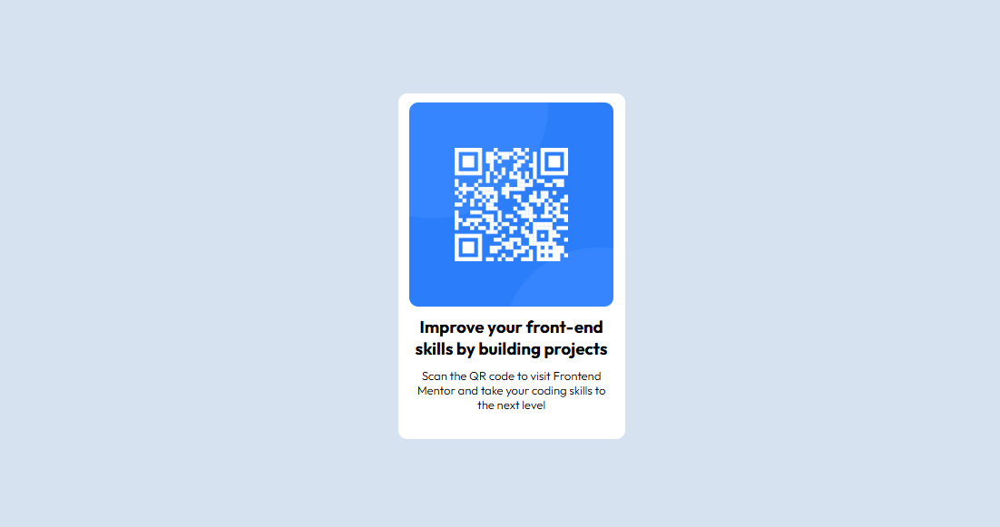

# QR Code Component

This is a simple **QR Code component project** I built while practicing HTML and CSS. It’s based on a Frontend Mentor challenge and helped me practice layout, centering elements, and basic styling.

## Purpose

The goal of this project was to:

- Improve my HTML & CSS fundamentals
- Learn how to properly structure a card layout
- Practice making elements responsive and centered

## Built With

- HTML  
- CSS (Flexbox)

## Screenshot



## How to Run It

1. Clone the repo:
   ```bash
   git clone https://github.com/peaaccceee/QR-Code.git
   ```
2. Open ```index.html``` in your browser

# Notes
This project was built for practice purposes. It’s part of my journey to strengthen my frontend development skills.